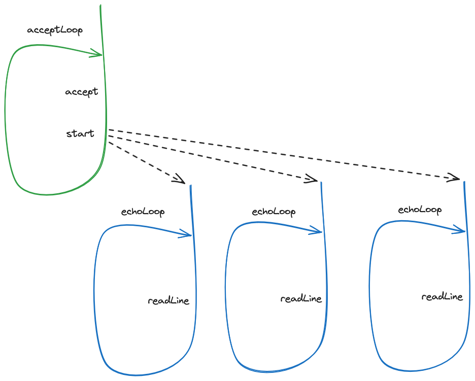

= A motivating example

To motivate the use of threads, we are going to implement a little echo server - an application that accepts connections from remote clients and that echoes all the lines received on each accepted connection.
An echo server may not seem very useful, however it will allow us to introduce the concepts and challenges associated to multi-threading in a more concrete scenario.
And an echo server is just the starting point to more complex and useful server system, such as an instant messaging server.

== A single-threaded server

We will start our journey by creating a single-threaded server 
(link:../../jvm/src/main/kotlin/pt/isel/pc/apps/echoserver/EchoServer0SingleThreaded.kt[source code]).

[source, kotlin]
----
include::../../jvm/src/main/kotlin/pt/isel/pc/apps/echoserver/EchoServer0SingleThreaded.kt[]
----

* The `run` function creates a `ServerSocket`, i.e., an object that is able to listen and accept connections, and binds it to a listening address and a port.

* The `acceptLoop` function calls `accept` over the `ServerSocket` instance, blocking until a remote connection is established to the server. 
When that happens, `accept` will return a `Socket` instance, representing that connection. 
After the `accept` call, the `acceptLoop` function calls `echoLoop` to echo all lines received through this socket.

* The `echoLoop` function creates a reader and a writer on top of the socket, presents a welcome message, and waits for a line to be received
Then it simply writes the line back into the socket, in upper case.
The loop ends when the `readLine` returns `null`, meaning the socket was closed, or when the `exit` string is sent by the remote client.

* When the `echoLoop` function returns, the control flow goes back to the `acceptLoop` function, to listening and accepting a new connection.

IMPORTANT: run this server and test it using a TCP/IP client, such as link:https://linux.die.net/man/1/nc[nc]. Use more than one client instance simultaneously connected to the server (e.g. by using multiple shells).

An important limitation of the previous implementation is that it can only handle one connection at a given time.
A new connection is only accepted after the `echoLoop` function returns, i.e., after a previous connection is terminated.
This is a consequence of only existing a single control flow, which is either accepting lines from a connection or accepting new connections, but not both.

== A multi-threaded server

A solution to the previous limitation is to create multiple control flows via the creation of multiple threads:

* A single thread will be accepting new connections.
* _N_ threads will be echoing received lines from _N_ connections - a thread per connection.

The multi-threaded server (link:../../jvm/src/main/kotlin/pt/isel/pc/apps/echoserver/EchoServer1ThreadPerConnection.kt[source code]) implementation uses the ability to created and start multiple threads, provided by the JVM platform.

[source, kotlin]
----
include::../../jvm/src/main/kotlin/pt/isel/pc/apps/echoserver/EchoServer1ThreadPerConnection.kt[]
----

The main changes are on the `acceptLoop` function.

* First, a `threadBuilder` is created before the cycle starts. This will allow us to create threads.
* Then, after receiving a new `socket` from the `accept` call, the function does

[source, kotlin]
----
val socket = serverSocket.accept()
(...)
val newClientId = ++clientId
threadBuilder.start {
    logger.info("created and started thread to handle client {}", newClientId)
    echoLoop(socket, newClientId)
}
----

instead of

[source, kotlin]
----
val socket = serverSocket.accept()            
echoLoop(socket, ++clientId)
----

The `threadBuilder.start` call will create a new thread, which will execute the passed in function, namely the `echoLoop` call, _simultaneously_ with thread running the `acceptLoop`.

We now have two control flows, i.e., two threads:

* The previously existing thread, waiting for a new connection.

* The newly created thread, waiting for a line from on the previously accepted connection.

IMPORTANT: The call to `threadBuilder.start` returns **before** the code in the passed in block is run, namely the `echoLoop` function.

When a second connection is accepted, then a third thread is created to handle this new connection.
This design is designated by _thread-per-connection_, because there will be a thread dedicated to each connection.

.Multi-thread design
[#img-multi-threaded-design]

At first, this multi-threading thing seems rather easy: we just call `start` on a thread builder and that's it.
However, this is very far from the truth: by having multiple threads in the same program, sharing mutable data, we just created a whole new class of problems and challenges.
The concurrent programming course main goal is to provide the knowledge and the skills to create correct programs that use more than one thread.

As a appetizer to what follows, consider the following code

[source, kotlin]
----
val newClientId = ++clientId
threadBuilder.start {
    logger.info("created and started thread to handle client {}", newClientId)
    echoLoop(socket, newClientId)
}
----

A curious mind may be thinking why `newClientId` is required. 
Namely, why isn't `clientId` directly used on the function passed in to `start`?

[source, kotlin]
----
++clientId
threadBuilder.start {
    logger.info("created and started thread to handle client {}", clientId)
    echoLoop(socket, clientId)
}
----

The answer is simple: the former design using `newclientId` is correct, while the later design is incorrect.
And by incorrect we mean that there isn't the guarantee that `echoLoop`` will always be called with distinct incrementing client IDs.

== The road ahead

This little example provides the basis for some interesting challenges, that we will address in the Concurrent Programming course

=== Data Synchronization

Suppose we want to maintain a counter with all active connections. 
That counter can be incremented in the thread running `acceptLoop`, however probably needs to be decremented in each of the threads running `echoLoop`.
This introduces the problem of a data variable mutated and read by more than one thread.
This will require the use of proper _data synchronization_ to ensure correctness.

=== Control Synchronization

Another feature that we may want do add is to limit the number of handled connections on any moment.
That requires the call to `serverSocket.accept` to be delayed until the handling of a connection ends, when that number is reached.
This introduces the problem of coordination between threads, also called _control synchronization_, where threads _wait_ for certain conditions to be true.

=== Virtual threads and Kotlin coroutines

A thread-per-connection design requires as many threads as connections. 
However threads have a computational cost that is much higher than connections, namely the required memory.
I.e. it is possible to have much more connections that threads.
Virtual threads and Kotlin coroutines are two ways of dealing with the problem, that we will address in this course.
